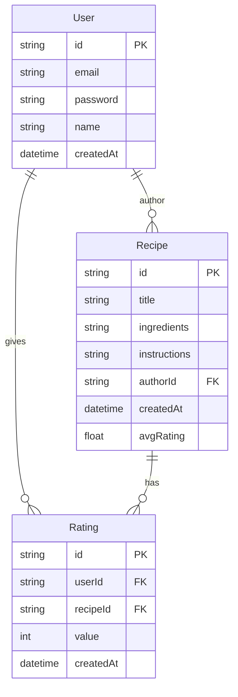

# 🍽️ FlavorAI — Recipe Discovery Platform

> Modern full-stack app for discovering, creating, and rating recipes.  
> Built with **Next.js + Tailwind**, **NestJS**, **PostgreSQL**, and **Prisma**.

---

## ✨ Features
- 🔐 JWT Authentication  
- 🧑‍🍳 Create & manage recipes  
- ⭐ Rate recipes (1–5)  
- 🔎 Instant search with dropdown results  
- 🎨 Cool glassmorphism + gradient UI

---

## 🚀 Quick Start

```bash
# backend
cd backend
npm install
npx prisma db pull   # or: npx prisma migrate dev
npm run start:dev

# frontend
cd frontend
npm install
npm run dev
```

- Frontend → http://localhost:3000  
- Backend → http://localhost:3001  

---

## 🔒 Environment Variables

Create `.env` in **backend**:

```env
DATABASE_URL="postgresql://<DB_USERNAME>:<DB_PASSWORD>@localhost:5432/<DB_NAME>?schema=public"
JWT_SECRET="Secret"
JWT_EXPIRATION=3600s
```

---

## 🗄️ Database Schema


## 🖼️ Screenshot


